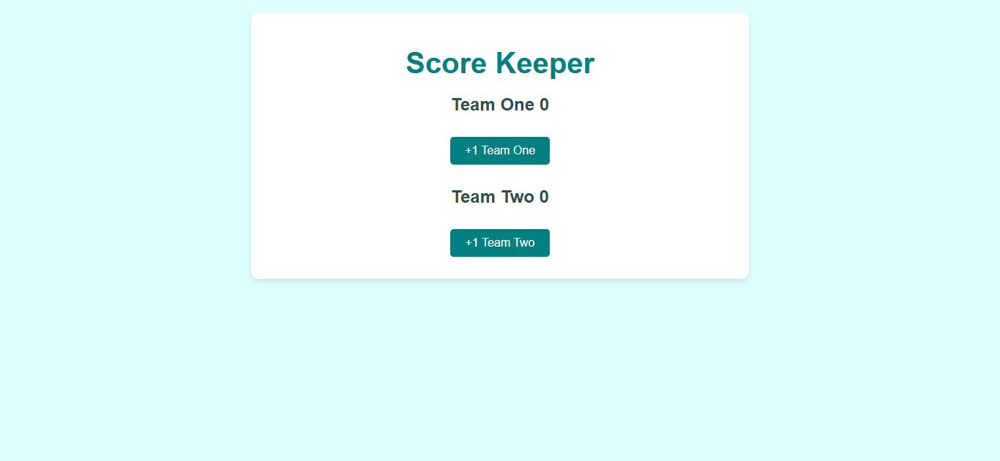
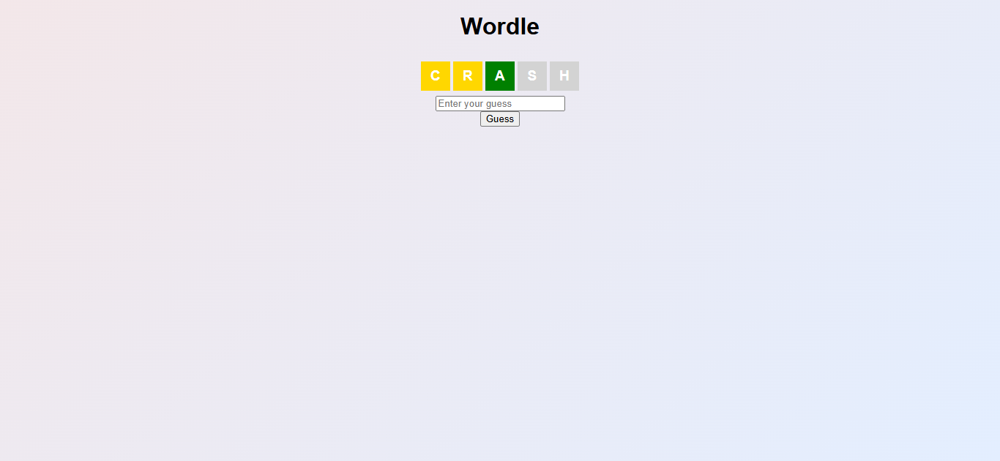
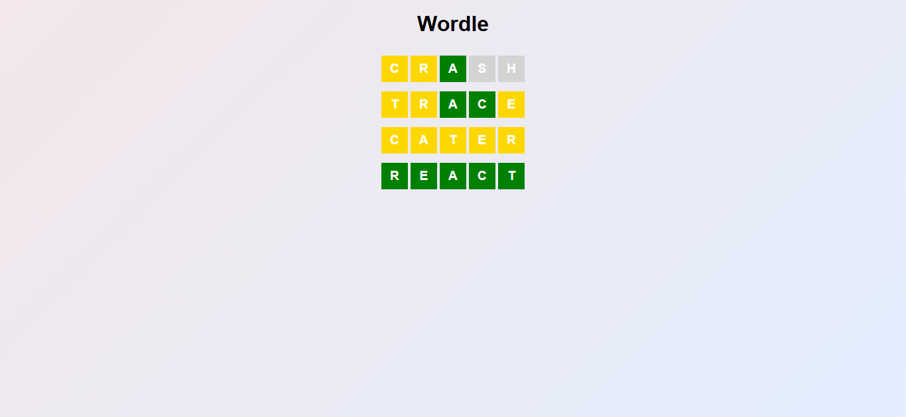

# React Mimo

<p align="center">
    <a href="https://developer.mozilla.org/pt-BR/docs/Web/JavaScript"></a>
    <a href="https://react.dev/"></a>
    <a href="https://create-react-app.dev/"></a>
    <a href="#"></a>
    <a href="LICENSE"></a>
</p>

Repositório de projetos práticos e exercícios de React desenvolvidos dentro do curso Mimo. O objetivo principal é consolidar conceitos fundamentais da biblioteca React, como componentes, props, estado, renderização condicional e lógica de interface.

## Sumário

- [Visualização](#visualização)
- [Descrição do Projeto](#descrição-do-projeto)
- [Arquitetura e Estrutura do Repositório](#arquitetura-e-estrutura-do-repositório)
- [Como Executar Localmente](#como-executar-localmente)
- [Uso e Exemplos](#uso-e-exemplos)
- [Troubleshooting / FAQ](#troubleshooting--faq)
- [Contribuição](#contribuição)
- [Autor](#autor)
- [Licença](#licença)

## Visualização

### Score Keeper



### Wordle Clone





## Descrição do Projeto

Este repositório reúne uma coleção de aplicações web construídas com React para aprendizado e prática. Cada projeto foi desenvolvido como uma mini aplicação independente, com foco na exploração de conceitos específicos da biblioteca e na criação de interfaces interativas do zero.

A principal tecnologia utilizada é React, em conjunto com JavaScript moderno e estilos CSS para a construção de interfaces. O conteúdo abrange aplicações simples e exercícios de lógica, incluindo gestão de estado, interação com eventos e renderização dinâmica.

## Arquitetura e Estrutura do Repositório

A organização do projeto é simples e direta:

```text
react-mimo/
├── LICENSE
├── README.md
├── .gitattributes
└── projetos-gerais/
    ├── score-keeper/
    │   ├── public/
    │   └── src/
    │       ├── App.js
    │       ├── App.css
    │       ├── ScoreKeeper.js
    │       ├── ScoreView.js
    │       └── ...
    └── wordle-clone/
        ├── public/
        └── src/
            ├── App.js
            ├── App.css
            ├── Row.js
            └── ...
```

### Estrutura observada

- `projetos-gerais/`: diretório raiz dos projetos de aprendizado.
- `score-keeper/`: aplicação de contagem de pontos e estado compartilhado.
- `wordle-clone/`: clone do jogo Wordle, com regras e lógica de interação mais complexas.
- `public/`: arquivos públicos e HTML base do app.
- `src/`: código-fonte principal, incluindo componentes, estilos e lógicas da aplicação.

### Fluxo de dados

Como se trata de projetos frontend em React, o fluxo principal é:

1. O usuário interage com a interface;
2. Eventos disparam atualizações de estado local;
3. Os componentes re-renderizam com base no novo estado;
4. As mudanças são refletidas visualmente na interface sem necessidade de backend.

Esses projetos são executados de forma independente, com cada app possuindo seu próprio `package.json` e ambiente local.

## Como Executar Localmente

### Pré-requisitos

- Node.js 18 LTS ou superior
- npm (geralmente incluso com o Node.js)
- Git para clonar o projeto

### Configuração de Ambiente

Não há variáveis de ambiente exigidas para a execução atual do repositório. Os projetos são renderizados localmente em React sem dependência de `.env` ou serviços externos.

### Instalação

1. Clone o repositório:

```bash
git clone https://github.com/GiovanniJorge/react-mimo.git
cd react-mimo
```

2. Acesse a pasta do projeto desejado:

```bash
cd projetos-gerais/score-keeper
```

ou

```bash
cd projetos-gerais/wordle-clone
```

3. Instale as dependências:

```bash
npm install
```

### Execução

Para iniciar a aplicação em modo de desenvolvimento:

```bash
npm start
```

O projeto será executado localmente, normalmente em:

```text
http://localhost:3000
```

Para gerar uma build de produção:

```bash
npm run build
```

## Uso e Exemplos

### Score Keeper

A aplicação de pontuação permite:

- incrementar ou decrementar valores;
- acompanhar a pontuação em tempo real;
- exibir feedback visual com base no estado atual.

### Wordle Clone

O clone do Wordle inclui:

- matriz de letras;
- entrada e validação de tentativas;
- lógica de comparação com palavra alvo;
- feedback visual por linha e status das letras.

Esses projetos servem como referência prática para aprender manipulação de estado, renderização condicional, composição de componentes e lógica de interação em React.

## Troubleshooting / FAQ

### 1. O projeto não inicia

Verifique se o Node.js está instalado e atualizado:

```bash
node -v
npm -v
```

Se necessário, reinstale o Node.js e rode novamente:

```bash
npm install
```

### 2. Erro de dependência ao instalar

Remova a pasta `node_modules` e o lockfile, se existir, e reinstale:

```bash
rm -rf node_modules package-lock.json
npm install
```

### 3. Porta 3000 já está em uso

O React usa a porta 3000 por padrão. Se ela estiver ocupada, o terminal pode sugerir outra porta automaticamente. Caso contrário, basta encerrar o processo que está usando a porta ou ajustar manualmente as configurações do ambiente.

### 4. O projeto foi executado, mas não aparece corretamente

Confirme se você entrou na pasta correta antes de rodar:

```bash
cd projetos-gerais/<nome-do-projeto>
npm start
```

## Contribuição

Contribuições são bem-vindas. Para colaborar com melhorias, novos projetos ou ajustes:

1. Faça um fork do repositório.
2. Crie uma branch com nome descritivo:
   ```bash
   git checkout -b feature/nova-funcionalidade
   ```
3. Faça commits claros e objetivos.
4. Abra um Pull Request descrevendo a mudança.

## Autor

- Nome: Giovanni Jorge
- GitHub: [@GiovanniJorge](https://github.com/GiovanniJorge)

## Licença

Este projeto está licenciado sob a licença MIT. Consulte o arquivo `LICENSE` na raiz do repositório para mais informações.
